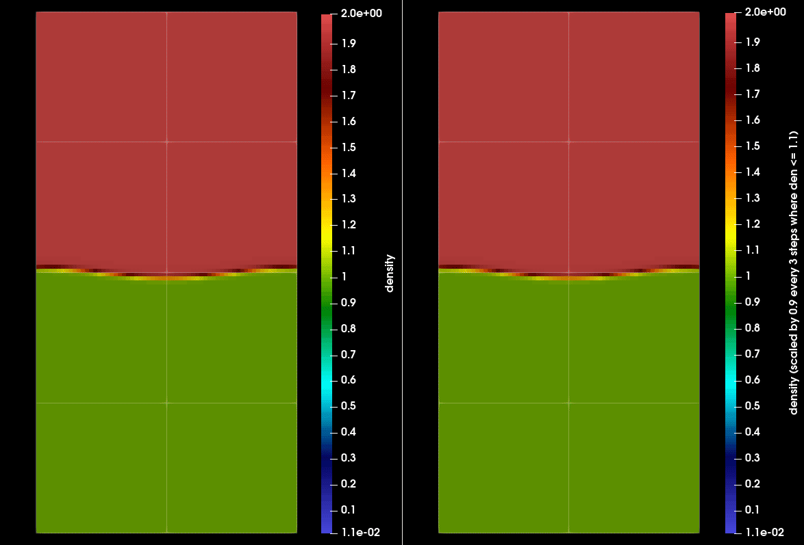

# IAMR write back
This is an example illustrating how to modify simulation state directly
from a Python script while running in situ using SENSEI.

The following assumes that you cloned *this* repo next to your IAMR clone.

This example runs a user provided Python script from IAMR every 3 coarse time
steps.  The user provided script scales the density field by 0.9 where the
field is below 1.1. Data is passed from IAMR into the Python script using a
zero-copy mechanism so that modifications to the passed arrays are seen by
IAMR. We use numpy to manipulate simulation data. However, note that some numpy
operations make intermediates and copies of the data and thus one may need to
explicitly copy calculations using VTK APIs.

The folloing figure shows the run with(right) and without(left) the SENSEI
script activated:



## Installing SENSEI with the Python backend
In the directory where you have cloned IAMR:
```
module switch PrgEnv-intel/6.0.5 PrgEnv-gnu
module load cmake/3.14.4
export CRAYPE_LINK_TYPE=dynamic

git clone https://github.com/SENSEI-insitu/SENSEI_superbuild.git

cd SENSEI_superbuild
mkdir build && cd build

cmake -DENABLE_READLINE=ON \
    -DENABLE_MPICH=OFF -DENABLE_CRAY_MPICH=ON \
    -DSENSEI_BRANCH=develop \
    -DSENSEI_BACKEND=python ../

make -j32
make -j32 install
```
This should install SENSEI for use with Python next to
the `SENSEI_Superbuild` clone in a directory named `sensei-develop-python`.


## Using SENSEI with the Python backend
Once installed SENSEI will need to be brought into the environment.
The install will include a modulefile for use on Cori or other systems
with environment modules. To load it:
```
module use /path/to/sensei-develop-python/modulefiles
module load sensei/develop-python
```

## Adding Python packages
Use `pip3` with the SENSEI module loaded. For example to install torch:
```
pip3 install torch
```

## Compiling IAMR for use with SENSEI
Apply the folloing patch in the root of the IAMR source tree. Note, this patch
is also in the merge request, https://github.com/AMReX-Codes/IAMR/pull/42.

```
git am -3 ../IAMR_write_back/0001-integrate-SENSEI-into-the-build.patch
```

Once the patch is applied cd into the `Exec/run2d` directory and edit the GNUmakefile,
set `USE_SENSEI_INSITU = TRUE`.

The SENSEI modulefile will need to be loaded as described above to compile IAMR
with SENSEI support:

```
source sensei_config
make -j4
```

## Running the example
First copy the configuration files from the root where everything is cloned:
```
cp ./IAMR_write_back/scale_den.xml ./IAMR/Exec/run2d/
cp ./IAMR_write_back/scale_den.py ./IAMR/Exec/run2d/
cp ./IAMR_write_back/inputs.2d.rt_wb ./IAMR/Exec/run2d/
```
Then execute IAMR:
```
./amr2d.gnu.MPI.ex inputs.2d.rt_wb
```

## SENSEI run time configuration
The parm parse code in the inputs files enables and configures SENSEI
to run every 3 coarse time steps.
```
sensei.enabled      = 1
sensei.config       = scale_den.xml
sensei.frequency    = 3
```

The following XML file tells SENSEI to use a user provided  Python script when it
is invoked.
```xml
<sensei>
  <!-- Place this XML and the Python file in the same directory
       as the IAMR executable -->
  <analysis type="python" script_file="scale_den.py" enabled="1">

     <!-- Runtime control variables. The field named by arrayName is
          scaled by the multiplier where it is below the threshold.
          Note that this is Python code and there for indentation
          of the code must follow Python's rules -->
    <initialize_source>
arrayCen = vtkDataObject.CELL
meshName='mesh'
arrayName='density'
threshold=1.1
multiplier=0.8
verbose = True
     </initialize_source>
  </analysis>
</sensei>
```

The following Python script scales values in a named array  that are below the
threshold by a given multiplier. The names of arrays, and values of threshold
and multiplier are set in the XML. Note that in this script we treat AMReX mesh
hierarchy as a collection of blocks, however one can also access domain map ,
box arrays, refinement ratios etc via dataAdaptor.GetMeshMetadata API. One can
also process the mesh level by level by casting the mesh object to a
vtkOverlappingAMR object.
```Python
import sys
import numpy as np
import vtk.util.numpy_support as vtknp
from vtk import vtkDataObject, vtkCompositeDataSet, vtkMultiBlockDataSet

# set default values of control parameters
# these can be modified by the XML
meshName = 'mesh'
arrayName = 'density'
arrayCen = vtkDataObject.CELL
threshold = 1.5
multiplier = 0.5
verbose = True

def Initialize():
    # print some info indicating that we are alive and the values
    # about to be used
    r = comm.Get_rank()
    if r == 0:
        if verbose:
            sys.stderr.write('meshName=%s, arrayName=%s, threshold=%g, multiplier=%g\n'%( \
                meshName, arrayName, threshold, multiplier))

def Execute(adaptor):
    r = comm.Get_rank()
    if r == 0 and verbose:
        sys.stderr.write('Execute\n')

    # use SENSEI API to
    # get the mesh and array we's like to modify.
    mesh = adaptor.GetMesh(meshName, True)
    adaptor.AddArray(mesh, meshName, arrayCen, arrayName)

    # visit each block in the AMR hierarchy. we are treating it like
    # a collection of blocks, but one could also iterate by level if needed
    it = mesh.NewIterator()
    it.InitTraversal()
    while not it.IsDoneWithTraversal():
        do = it.GetCurrentDataObject()

        atts = do.GetPointData() if arrayCen == vtkDataObject.POINT \
             else do.GetCellData()

        # get the data array from VTK
        vda = atts.GetArray(arrayName)

        # convert into a numpy representation.
        # TODO -- when if ever is this directly modifiable??
        da = vtknp.vtk_to_numpy(vda)

        # scale values below the threshold
        ii = np.where(da <= threshold)[0]
        da[ii] *= multiplier

        # use the VTK API to modify the AMReX data directly
        #nt = vda.GetNumberOfTuples()
        #i = 0
        #while i < nt:
        #    vda.SetValue(i, da[i])
        #    i += 1

        it.GoToNextItem()

def Finalize():
    # print that we are done
    r = comm.Get_rank()
    if r == 0 and verbose:
        sys.stderr.write('Finalize\n')
    return 0
```
